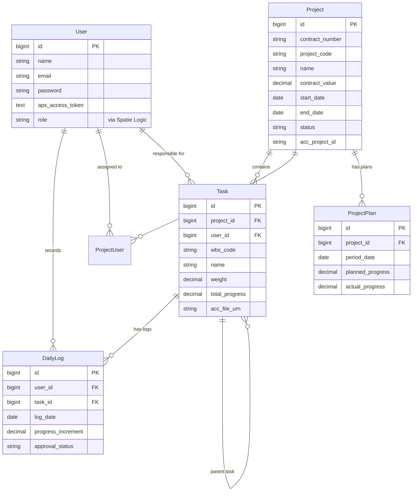

# Database Structure Documentation

This document outlines the database structure for the Project Management Application.

## Overview

The database is built on MySQL and uses standard Laravel migrations. The core entities are **Projects**, **Tasks**, **Users**, and **Daily Logs**, with additional support for **Reporting** (Project Plans) and **Permissions** (RBAC).

## ER Diagram

## Table Details

### 1. Users & Authentication

#### `users`

Stores user account information and authentication details.

| Column                 | Type      | Nullable | Attributes         | Description                              |
| :--------------------- | :-------- | :------- | :----------------- | :--------------------------------------- |
| `id`                   | bigint    | No       | PK, Auto-increment | Unique identifier                        |
| `name`                 | string    | No       |                    | Full name                                |
| `email`                | string    | No       | Unique             | Email address                            |
| `email_verified_at`    | timestamp | Yes      |                    | Date of email verification               |
| `password`             | string    | No       |                    | Hashed password                          |
| `remember_token`       | string    | Yes      |                    | "Remember me" token                      |
| `aps_access_token`     | text      | Yes      |                    | Autodesk Platform Services access token  |
| `aps_refresh_token`    | text      | Yes      |                    | Autodesk Platform Services refresh token |
| `aps_token_expires_at` | timestamp | Yes      |                    | Expiry time for APS token                |
| `created_at`           | timestamp | Yes      |                    | Creation timestamp                       |
| `updated_at`           | timestamp | Yes      |                    | Update timestamp                         |

---

### 2. Project Management

#### `projects`

Stores information about construction projects.

| Column              | Type          | Nullable | Attributes         | Description                           |
| :------------------ | :------------ | :------- | :----------------- | :------------------------------------ |
| `id`                | bigint        | No       | PK, Auto-increment | Unique identifier                     |
| `project_type`      | string        | No       |                    | Type of project                       |
| `contract_number`   | string        | No       | Unique             | Contract reference number             |
| `project_code`      | string        | No       | Unique             | Internal project code                 |
| `name`              | string        | No       |                    | Project name                          |
| `technical_service` | string        | No       |                    | Technical service category            |
| `sector`            | string        | No       |                    | Industry sector                       |
| `status`            | string        | No       | Default: 'Active'  | Project status                        |
| `contract_value`    | decimal(15,2) | Yes      |                    | Total value of the contract           |
| `owner`             | string        | Yes      |                    | Project owner/client                  |
| `consultant`        | string        | Yes      |                    | Project consultant                    |
| `address`           | text          | Yes      |                    | Site address                          |
| `description`       | text          | Yes      |                    | Project description                   |
| `start_date`        | date          | Yes      |                    | Project start date                    |
| `end_date`          | date          | Yes      |                    | Project end date                      |
| `contract_date`     | date          | Yes      |                    | Date of contract signing              |
| `acc_project_id`    | string        | Yes      |                    | Linked Autodesk Construction Cloud ID |
| `acc_account_id`    | string        | Yes      |                    | ACC Account ID                        |
| `acc_sync_status`   | string        | Yes      | Default: 'pending' | Status of ACC synchronization         |
| `created_at`        | timestamp     | Yes      |                    |                                       |
| `updated_at`        | timestamp     | Yes      |                    |                                       |

#### `project_user` (Pivot)

Associates users with projects and assigns them specific project roles.

| Column            | Type      | Nullable | Attributes         | Description                       |
| :---------------- | :-------- | :------- | :----------------- | :-------------------------------- |
| `id`              | bigint    | No       | PK, Auto-increment |                                   |
| `project_id`      | bigint    | No       | FK (projects)      |                                   |
| `user_id`         | bigint    | No       | FK (users)         |                                   |
| `role_in_project` | string    | No       |                    | Specific role within this project |
| `created_at`      | timestamp | Yes      |                    |                                   |
| `updated_at`      | timestamp | Yes      |                    |                                   |

---

### 3. Task Management (WBS)

#### `tasks`

Hierarchical Work Breakdown Structure (WBS) items.

| Column               | Type         | Nullable | Attributes         | Description                     |
| :------------------- | :----------- | :------- | :----------------- | :------------------------------ |
| `id`                 | bigint       | No       | PK, Auto-increment |                                 |
| `project_id`         | bigint       | No       | FK (projects)      | Parent project                  |
| `parent_id`          | bigint       | Yes      | FK (tasks)         | Parent task (for hierarchy)     |
| `user_id`            | bigint       | Yes      | FK (users)         | Assigned user                   |
| `wbs_code`           | string       | No       |                    | WBS numbering (e.g., "1.2.1")   |
| `name`               | string       | No       |                    | Task name                       |
| `weight`             | decimal(8,2) | No       | Default: 0         | Weight percentage of the task   |
| `coefficient`        | decimal(8,4) | No       | Default: 1.0000    | Pricing/effort coefficient      |
| `start_date`         | date         | No       |                    | Scheduled start                 |
| `end_date`           | date         | No       |                    | Scheduled end                   |
| `total_progress`     | decimal(8,2) | No       | Default: 0.00      | Current cumulative progress     |
| `sort_order`         | integer      | No       | Default: 0         | Display order                   |
| `acc_file_name`      | string       | Yes      |                    | Name of linked ACC file         |
| `acc_file_urn`       | string       | Yes      |                    | URN of linked ACC file          |
| `acc_file_version`   | integer      | Yes      |                    | Version of linked ACC file      |
| `acc_latest_version` | integer      | Yes      |                    | Latest available version in ACC |
| `acc_last_synced_at` | timestamp    | Yes      |                    | Last sync timestamp             |
| `created_at`         | timestamp    | Yes      |                    |                                 |
| `updated_at`         | timestamp    | Yes      |                    |                                 |

---

### 4. Operations & Tracking

#### `daily_logs`

Daily progress reports submitted by users.

| Column               | Type         | Nullable | Attributes          | Description                       |
| :------------------- | :----------- | :------- | :------------------ | :-------------------------------- |
| `id`                 | bigint       | No       | PK, Auto-increment  |                                   |
| `user_id`            | bigint       | No       | FK (users)          | Submitter                         |
| `task_id`            | bigint       | No       | FK (tasks)          | Related task                      |
| `log_date`           | date         | No       |                     | Date of work                      |
| `clock_in`           | time         | Yes      |                     | Start time                        |
| `clock_out`          | time         | Yes      |                     | End time                          |
| `progress_increment` | decimal(5,2) | No       | Default: 0          | Progress achieved (% added)       |
| `is_backdate`        | boolean      | No       | Default: false      | Was this logged retrospectively?  |
| `approval_status`    | string       | No       | Default: 'approved' | 'approved', 'pending', 'rejected' |
| `rejection_reason`   | string       | Yes      |                     | Reason if rejected                |
| `notes`              | text         | Yes      |                     | Additional comments               |
| `created_at`         | timestamp    | Yes      |                     |                                   |
| `updated_at`         | timestamp    | Yes      |                     |                                   |

---

### 5. Reporting & Analytics

#### `project_plans`

Stores the S-Curve planning data (planned vs. actual progress per day).

| Column             | Type         | Nullable | Attributes         | Description                |
| :----------------- | :----------- | :------- | :----------------- | :------------------------- |
| `id`               | bigint       | No       | PK, Auto-increment |                            |
| `project_id`       | bigint       | No       | FK (projects)      |                            |
| `period_date`      | date         | No       |                    | Date point for the S-Curve |
| `planned_progress` | decimal(8,2) | No       | Default: 0         | Cumulative planned %       |
| `actual_progress`  | decimal(8,2) | Yes      |                    | Cumulative actual %        |
| `created_at`       | timestamp    | Yes      |                    |                            |
| `updated_at`       | timestamp    | Yes      |                    |                            |

---

### 6. System & Configuration

#### `settings`

Key-value store for application configuration.

| Column       | Type      | Nullable | Attributes         | Description   |
| :----------- | :-------- | :------- | :----------------- | :------------ |
| `id`         | bigint    | No       | PK, Auto-increment |               |
| `key`        | string    | No       | Unique             | Setting key   |
| `value`      | text      | Yes      |                    | Setting value |
| `created_at` | timestamp | Yes      |                    |               |
| `updated_at` | timestamp | Yes      |                    |               |

#### `jobs`, `failed_jobs`, `cache`, `sessions`

Standard Laravel system tables for queue management, caching, and session handling.

#### Permissions (Spatie)

Standard `spatie/laravel-permission` tables:

- `roles`
- `permissions`
- `model_has_roles`
- `model_has_permissions`
- `role_has_permissions`
